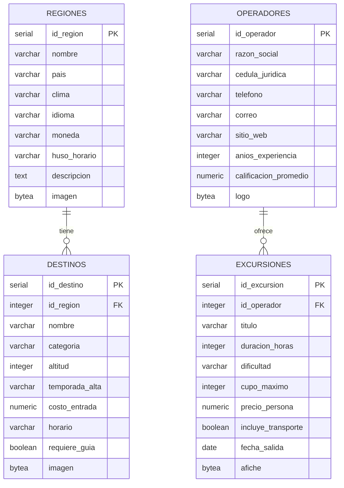
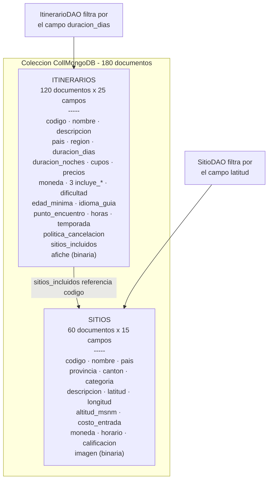
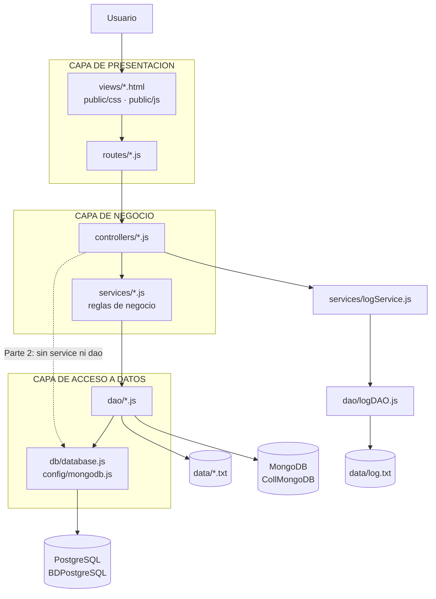
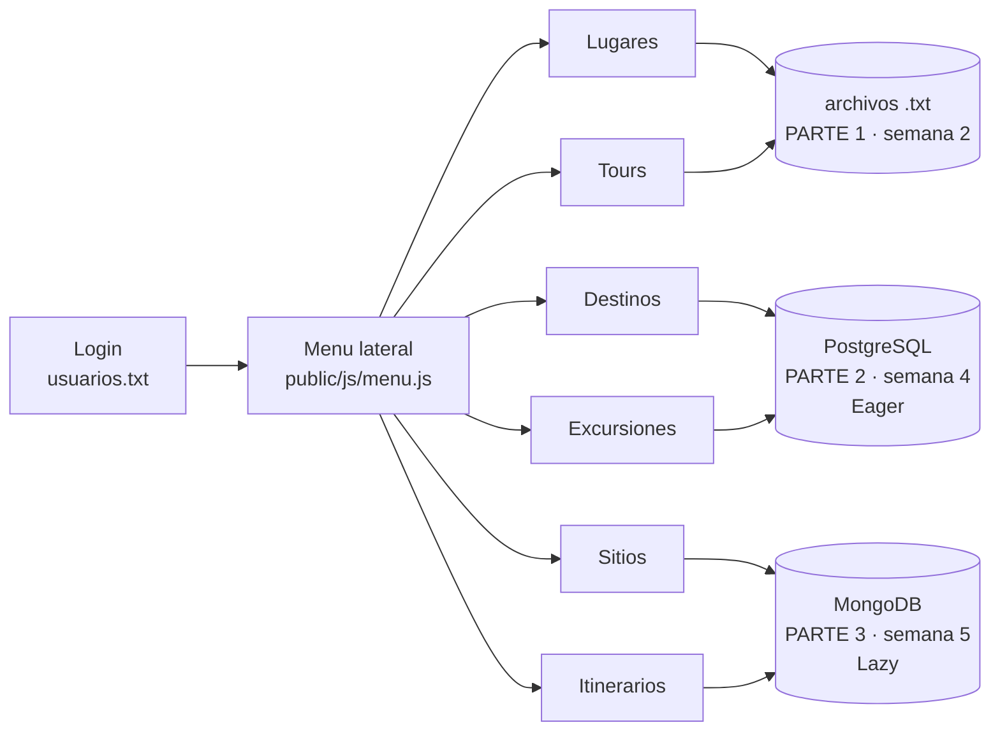

# Guía de presentación — Grupo 2

10 minutos y el tiempo cuenta. El profesor puede preguntar sobre el código, así que abajo
está cada pregunta probable con el archivo y la línea donde está la respuesta.

**Regla de oro:** si pregunta *"¿dónde está esto?"*, abrí el archivo y señalá la línea. No
expliques de memoria.

---

## 1. Recorrido sugerido (7 minutos de clics)

| Min | Qué hacer |
|---|---|
| 0-1 | Login con clave mala → error + se registra en `log.txt`. Login con `admin`/`12345` → entra |
| 1-2 | **Lugares**: Guardar, Modificar, Consultar, Eliminar. Provocar un error: calificación 150 |
| 2-3 | **Tours**: guardar uno con un lugar que no existe → error. Es la relación entre las 2 vistas |
| 3-5 | **Destinos**: crear una región **con imagen**, crear un destino, señalar la columna `region_nombre` que viene del JOIN → **Eager** |
| 5-6 | **Excursiones**: mismo recorrido, mencionar que son otras 2 tablas con 8 campos distintos |
| 6-7 | **Sitios**: MOSTRAR TODOS (60, sin imagen → **Lazy**), crear uno con imagen, consultarlo → aparece la miniatura |
| 7 | Abrir `data/log.txt` y mostrar que quedó todo registrado |

Dejá **Itinerarios** para si sobra tiempo: son los 120 documentos de 25 campos.

---

## 2. Preguntas sobre la Parte 1 (semana 2)

**¿Dónde se valida el usuario y la contraseña?**

| Capa | Archivo | Línea |
|---|---|---|
| Vista | `public/js/login.js` | 86 guarda el usuario, 95 redirige |
| Controlador | `controllers/authController.js` | 37 llama al servicio, 49 responde ok, 61 responde 401 |
| Servicio | `services/authService.js` | 23 lanza el error |
| DAO | `dao/usuarioDAO.js` | 30 la función, 32 lee `usuarios.txt` |

**¿Y el archivo de usuarios?** → `data/usuarios.txt`, formato `usuario;password`.

**¿Cómo se guarda un registro en el `.txt`?**
`dao/lugarDAO.js` — `leerArchivo()` hace `split("\n")` y luego `split(";")`;
`escribirArchivo()` arma la línea con `;` y usa `writeFileSync`.

**¿Dónde están las reglas de negocio?**
En los servicios, nunca en el controlador:

| Validación | Archivo y línea |
|---|---|
| Campos obligatorios | `services/lugarService.js:40` |
| `isNaN` | `services/lugarService.js:46` |
| Rango 0 a 100 | `services/lugarService.js:53` |
| Código duplicado | `services/lugarService.js:64` |
| El registro no existe | `services/lugarService.js:85` |
| **El lugar del tour debe existir** | `services/tourService.js:61` al guardar, `:121` al modificar |

Esa última es la que amarra las dos vistas de la Parte 1.

**¿Por qué `isNaN`?** Porque pregunta *"¿es un valor que NO es número?"*, no al revés.
Es la nota de la sesión 7.

**¿Dónde está la bitácora que pide el enunciado?**

| Qué | Archivo | Línea |
|---|---|---|
| Formato `Fecha – Hora / "Acción" / Usuario` | `services/logService.js` | 14 a 45 |
| Escritura en modo agregar | `dao/logDAO.js` | 47 — `fs.appendFileSync` |

**¿Por qué `appendFileSync` y no `writeFileSync`?** Porque `writeFileSync` sobreescribe y
la bitácora tiene que acumular. Es el modo `"a"` de la lista de la sesión 7:
`"r"`, `"w"`, `"a"`, `"x"`, `"r+"`. La codificación es UTF8.

**¿Se registran todas las acciones?** Sí, los controladores de las **tres** partes llaman a
`LogService.registrar()`: autenticación correcta y fallida, deslogueo, y cada operación del
CRUD.

---

## 3. Preguntas sobre la Parte 2 (semana 4, PostgreSQL)

**¿Dónde usaron la carga Eager y cómo?**

| Archivo | Línea |
|---|---|
| `controllers/destinoController.js` | **17** el comentario, **22** el `INNER JOIN` |
| `controllers/excursionController.js` | **17** el comentario, **22** el `INNER JOIN` |

Respuesta corta: *"El `INNER JOIN` trae el destino y su región en una sola consulta. La
alternativa perezosa sería listar los destinos y después una consulta por cada fila para
traer su región, el problema N+1. La prueba es que la tabla muestra `region_nombre` sin
ningún fetch adicional."*

Si pregunta por ORM: la sesión 8 dice que Lazy y Eager *"aparecen o se implementan con
ORM/ODM"*. La semana 4 no usa ORM, así que el equivalente en SQL es resolver la relación
dentro de la misma consulta.

**¿Cuántos campos tiene cada tabla?** 8 sin contar llaves ni relaciones. Se ve en
`ProyectoP4-PostgreSQL-Grupo-2/ScriptCrearBaseDatos.sql`:

| Tabla | Línea del `CREATE TABLE` |
|---|---|
| `regiones` | 50 |
| `destinos` | 75 |
| `operadores` | 107 |
| `excursiones` | 132 |

**¿Dónde se guarda la imagen?**

La imagen no viaja dentro del JSON: tiene su propio endpoint y va como **bytes crudos**.

| Paso | Archivo | Línea |
|---|---|---|
| El navegador manda el archivo tal cual | `public/js/destinos.js` | `subirImagen()` — `body: archivo` |
| Express lo recibe como `Buffer` | `routes/regionRoutes.js` | **33** — `express.raw({ type: "image/*" })` |
| Se escribe directo en la columna | `controllers/regionController.js` | **192** la función, **207** el `UPDATE ... SET imagen = $1` |
| Se devuelve con su tipo | `controllers/regionController.js` | **262** el `Content-Type`, **281** cómo se deduce |
| El tipo de la columna | `ScriptCrearBaseDatos.sql` | 61 `imagen BYTEA`, 118 `logo BYTEA` |

**¿Por qué `BYTEA`?** Es el tipo binario de PostgreSQL, el equivalente al `BLOB` de MySQL.

**¿Cómo saben el tipo de imagen si no lo guardan en un campo?**
Se deduce de los primeros bytes del archivo: `89 50` es PNG, `FF D8` es JPEG, `47 49` es GIF.
Así no hizo falta un campo extra que rompiera el conteo de 8 campos por tabla.

**Verificación en vivo, en pgAdmin:**

```sql
SELECT pg_typeof(imagen), octet_length(imagen), substring(imagen from 1 for 4)
FROM regiones WHERE imagen IS NOT NULL;
```

Devuelve `bytea | 70 | \x89504e47`. Esos cuatro bytes son la firma de un PNG.

**¿Dónde está la capa de datos?** `db/database.js` — el `Pool` de `pg`. Según la sesión 5 es
*"el responsable exclusivo de establecer la conexión"*. El controlador y las rutas
representan la capa de presentación.

**¿Cómo pasan los parámetros al SQL?** Con `$1, $2` y un arreglo, nunca concatenando texto.
Es la pregunta de la sesión 5: *"¿es mediante paréntesis cuadrados? R/ sí"*.

**¿Qué pasa si el `DELETE` no encuentra el registro?**
`controllers/destinoController.js:114` y `158` — `resultado.rows.length === 0` → 404. Es la
validación que el profesor recalcó: la instrucción no da error pero tampoco hace el CRUD.

---

## 4. Preguntas sobre la Parte 3 (semana 5, MongoDB)

**¿Dónde usaron la carga Lazy y cómo?**

| Archivo | Línea |
|---|---|
| `dao/SitioDAO.js` | **184** el comentario, **194** `projection: { imagen: 0 }` |
| `dao/SitioDAO.js` | **213** `findOne` — aquí sí trae el documento completo |
| `dao/ItinerarioDAO.js` | **194**, **204** y **223**, con `afiche` |

Respuesta corta: *"El listado de 60 documentos no carga el campo binario: la proyección lo
excluye. Solo se trae al consultar un documento concreto, que es cuando de verdad se
necesita."*

**¿Cómo conviven los 60 y los 120 documentos en la misma colección?**
`dao/SitioDAO.js:15` la colección `CollMongoDB`, y `:17` el `FILTRO`.
Los sitios son los únicos que tienen `latitud`; los itinerarios, `duracion_dias`. Se
distinguen con `$exists`, **sin agregar un campo extra**, para que el conteo quede exacto en
15 y 25 campos.

**¿Cuántos campos tiene cada documento?**
`dao/SitioDAO.js:23` — el arreglo `CAMPOS` con los 15.
`dao/ItinerarioDAO.js:23` — el arreglo con los 25.

**¿Y la imagen?**
Igual que en PostgreSQL: endpoint aparte y bytes crudos.

| Paso | Archivo | Línea |
|---|---|---|
| Recibe el `Buffer` y lo escribe | `dao/SitioDAO.js` | **74** — `guardarImagen(id, bytes)` |
| Lo devuelve para el `` | `dao/SitioDAO.js` | **111** — `obtenerImagen(id)` |
| La ruta con `express.raw` | `routes/sitioRoutes.js` | **40** |
| El navegador manda el archivo | `public/js/sitios.js` | **65** `subirImagen()`, **105** `verMiniatura()` |

**Verificación en vivo, en `mongosh`:**

```js
db.CollMongoDB.aggregate([
  { $match: { codigo: "SIT001" } },
  { $project: { tipo: { $type: "$imagen" }, bytes: { $binarySize: "$imagen" } } }
])
```

Devuelve `tipo: "binData"`. Y `$binarySize` **solo funciona sobre datos binarios**: si el campo
fuera texto, esa consulta daría error. Es la prueba más corta que existe.

**¿Y si edito sin escoger una imagen nueva?** No se borra: si el campo no viene, se quita del
`$set` y el documento conserva la que tenía. La Parte 2 hace lo mismo con un `COALESCE`.

**¿Cómo se relacionan las dos vistas?**
Cada itinerario tiene `sitios_incluidos`, un arreglo con los `codigo` de los sitios que
recorre. Todos existen entre los 60 y son de la misma región que el itinerario.

**¿Por qué el DAO es una clase y el de la semana 2 son funciones?**
Porque así viene cada semana: la semana 2 usa funciones con `module.exports = { ... }` y la
semana 5 usa clases con métodos `static async` en el controlador. Se conservó el estilo de
cada semana.

---

## 5. Las imágenes: lo único que hubo que investigar

Es la pregunta más probable sobre una decisión propia, porque **no se copió de ningún ejemplo
de clase**.

**¿De dónde sacaron esto si no se vio en clase?**
El profesor lo mandó a investigar, dos veces:

> **Enunciado, línea 147:** *"En cada tabla **investigar** cómo implementar un campo en
> PostgreSQL para almacenar y actualizar imágenes de forma binaria, manejadas de forma
> serializada desde la vista."*

> **`sesion8.md`, punto 2:** *"Serializar imágenes - **investigar**"*

Ninguno de los cuatro proyectos del curso tiene un `<input type="file">`, ni `Buffer`, ni
`BYTEA`. Es el único punto donde el enunciado autoriza salirse del material.

**¿Y en qué se apoyaron?**
En la tabla de tipos de campo de la materia, `MySQL vs PostgreSQL`, que da el equivalente del
binario: **`BLOB` en MySQL ↔ `BYTEA` en PostgreSQL**.

**¿Cómo funciona?**

```
  navegador                      servidor                      base de datos
  ---------                      --------                      -------------
  <input type="file">            express.raw()                 BYTEA     (PostgreSQL)
  fetch(..., body: archivo)  -->  req.body es un Buffer   -->   binData   (MongoDB)
       los bytes del archivo      se escribe sin convertir

     <--  Content-Type: image/png
```

Los bytes del archivo no se convierten en ningún punto del recorrido. Se leen del disco, se
mandan, se guardan y se devuelven **iguales**.

**¿Por qué un endpoint aparte para la imagen?**
Porque el JSON del formulario no puede llevar bytes. Separando la imagen en su propio
endpoint, el registro se guarda con `fetch` + JSON como en las tres semanas, y la imagen viaja
por su propio camino sin transformarse.

**¿No se podía meter la imagen en el mismo JSON?**
Sí, convirtiéndola a base64, y así estaba antes. Se cambió para que en ninguna parte del
código haya una conversión: lo que sale del disco es lo que entra a la base.

**¿Por qué no guardar la ruta del archivo o una URL?**
Porque el enunciado pide *"serialización de imágenes **dentro de las bases de datos**"* y *"de
forma **binaria**"*. Una URL sería un `VARCHAR`: ni es binario, ni la imagen queda dentro de la
base.

**El punto que conviene tener pensado.** El enunciado pide dos cosas: *"binaria"* y
*"manejadas de forma serializada desde la vista"*. La primera es incuestionable: `bytea` en
PostgreSQL y `binData` en MongoDB, verificable en vivo. La segunda, con bytes crudos, se
sostiene en que **un archivo PNG ya es de por sí una representación serializada de una
imagen**: no es un mapa de píxeles en crudo, es un formato con una estructura fija —

```
89 50 4E 47 0D 0A 1A 0A   firma del archivo (siempre estos 8 bytes)
00 00 00 0D 49 48 44 52   chunk IHDR: ancho, alto, profundidad de color...
...                        chunk IDAT: los píxeles, comprimidos
00 00 00 00 49 45 4E 44   chunk IEND: fin del archivo
```

Esa cabecera, `89 50 4E 47`, es la que se ve en `octet_length`/`substring` de PostgreSQL y en
el byte de tipo del BSON de Mongo. Serializar es convertir una estructura (aquí, una matriz de
píxeles con su color por canal) en una secuencia lineal de bytes que se pueda guardar o
transmitir — y eso es exactamente lo que hace el formato PNG antes de que el archivo llegue
al servidor. El servidor no lo deserializa ni lo vuelve a serializar: lo mueve tal cual. Es
correcto, pero es la parte más discutible del enfoque, así que vale tener la respuesta lista
en vez de improvisarla.

**¿Por qué en Compass se ve `Binary.createFromBase64(...)` y en pgAdmin `[binary data]`?**
Son dos maneras de mostrar el mismo tipo, no dos comportamientos distintos. Ningún visor puede
imprimir bytes crudos en una pantalla de texto, así que cada herramienta elige un formato:

| | Compass | pgAdmin |
|---|---|---|
| Qué hace | Muestra el valor completo, como literal de shell (`Binary.createFromBase64(...)`), truncado con `…` | Muestra un aviso (`[binary data]`) y pide un clic para abrir el visor |
| Por qué | El visor de documentos de Compass siempre muestra el valor en línea | pgAdmin evita cargar blobs grandes en la grilla por rendimiento |

La prueba está en que **las dos herramientas se toman la molestia de marcar el campo como
especial**. Si el dato fuera un texto común, Compass lo imprimiría entre comillas sin el
`Binary.createFromBase64(...)`, y pgAdmin mostraría el texto directamente en la celda, sin el
aviso `[binary data]`. Que ambas reaccionen distinto frente a este campo es la confirmación de
que las dos lo reconocen como binario — cada una a su manera.

## 6. Preguntas transversales

**¿Por qué el orden de las rutas importa?**
`routes/sitioRoutes.js` — las rutas literales van antes que `/:id` (líneas 36, 43, 50).
Express recorre de arriba abajo y usa la primera que coincide; si `/:id` va primero, tapa a
todas las que vienen después. En `routes/lugarRoutes.js`, `/lugares/pagina` (línea 22) va
antes de `/lugares/:codigo` (88) por lo mismo.

**¿Dónde está el JavaScript?**
En `public/js/`, 8 archivos. Ninguna vista tiene `<script>` con código adentro: todas lo
invocan con `<script src="...">`. Es el requerimiento E.

**¿Cómo manejan los errores?**

| Capa | Patrón |
|---|---|
| Servicio | `throw new Error("...")` |
| Controlador | `try/catch` → `res.status(400/401/404/500).json({mensaje})` |
| PostgreSQL | además `rows.length === 0` → 404 |
| Vista | muestra el mensaje del servidor y tiene `catch` de red |
| App | ruta final que responde 404 en `app.js` |

**¿Cómo protegen el acceso sin sesión?**
El código de la semana 2 no usa sesiones. `public/js/login.js:86` guarda el usuario en
`localStorage` y `public/js/menu.js:101` verifica que exista: si no hay usuario, redirige al
login. Al salir se borra con `localStorage.removeItem`.

**¿El menú está repetido en cada vista?**
No. `public/js/menu.js` lo dibuja una sola vez y marca la opción activa según la URL. Las
seis vistas solo lo invocan.

---

## 7. Diagrama de la base de datos PostgreSQL



Vista 3 son `regiones` → `destinos`. Vista 4 son `operadores` → `excursiones`. Ocho campos
por tabla sin contar `id_*`, y ninguno se repite entre las dos vistas.

---

## 8. Diagrama de MongoDB

MongoDB no tiene esquema ni llaves foráneas, así que no hay un diagrama entidad-relación
propiamente. Lo que sí se puede diagramar es **cómo conviven los dos tipos de documento en
una sola colección** y cómo se relacionan por código.



El punto a explicar: **una sola colección, dos formas de documento**, separadas por un campo
que solo existe en cada una. Así no hace falta un campo discriminador y el conteo se mantiene
exacto en 15 y 25.

---

## 9. Diagrama de la arquitectura



**El flujo que dictó el profesor:**

```
Botones → html → express route → controller → service → DAO → datos
```

**La excepción de la Parte 2, y hay que saber explicarla:** ahí el controlador habla directo
con `db/database.js`, sin `service` ni `dao`. No es un descuido, es como viene el código de
la semana 4: `db/database.js` representa la capa de datos, y el controlador y las rutas la
capa de presentación. En Three-Tier la comunicación fluye entre capas.

---

## 10. Las tres partes en una sola aplicación



---

## 11. Si pregunta algo que decidimos nosotros

Están todas en `03-DECISIONES.md`. Las que más probablemente salgan:

| Pregunta | Respuesta |
|---|---|
| ¿Por qué la base se llama `BDPostgreSQL`? | Es el nombre del enunciado. La de MongoDB no la nombra, así que se llama `proyecto1grupo2` |
| ¿El campo de imagen cuenta entre los 8? | Sí, se asumió que cuenta: 7 campos de datos + el binario |
| ¿Por qué no hay sesión de servidor? | El código de la semana 2 no la tiene. Se replicó su comportamiento y se protege con la verificación de `menu.js` |
| ¿Por qué la Parte 3 es solo MongoDB? | La distribución de puntos del enunciado habla solo de MongoDB, `CollMongoDB` y los dos `.JSON` |

**Si no sabés algo, decilo.** El enunciado advierte que responder mal cuesta puntos; admitir
una decisión y explicar en qué se basó vale más que inventar.
